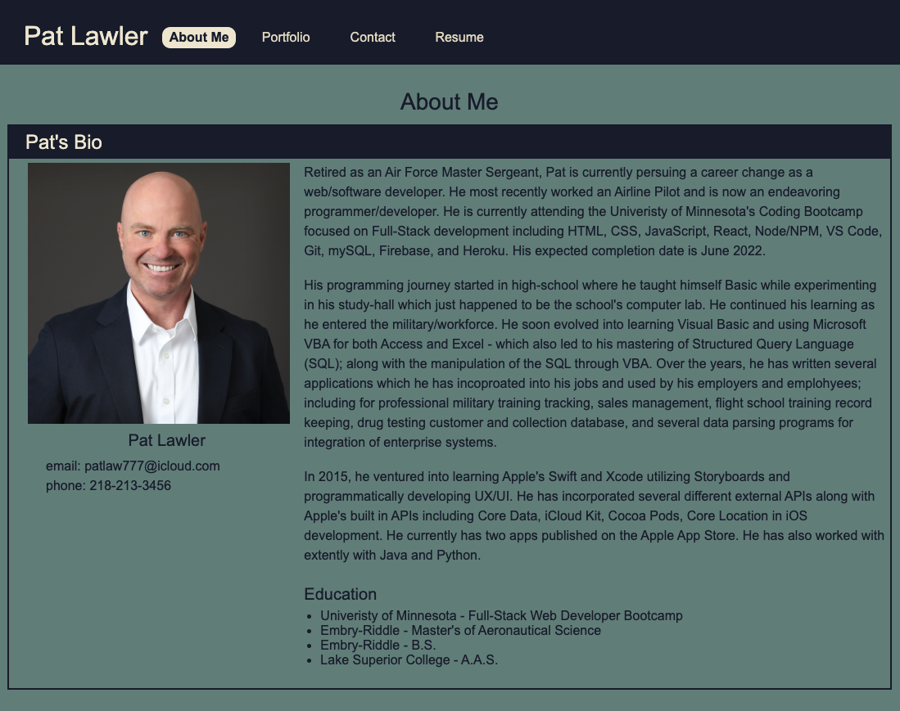

 
 # Pat's Portfolio
 ## *Table of Contents*
1. [Description](#description)
2. [Installation Instructions](#installation-instructions)
3. [Tests](#tests)
4. [Questions](#questions)
5. [License Info](#license-info)

 _ _ _
 ## *Description*
 ### This is my personal developer portfolio.  It was developed using React as an SPA and adaptable for mobile views. The app provides an About section with my personal contact info and social media links.  It also includes a portfolio section that displays several of my projects with links for their respective GitHub repository and a URL link to the deployed site or the URL where the app may be downloaded (i.e. The Apple App Store).

 ### Additionally there is a Contact section that allows the visitor directly send me an email right from the page. Finally in the Resume secion it displays a thumbnail imgage of my resume along with a link to download a pdf version.  Also listed on the same page are my proficiencies along with a rating to show my level of compentancy for each one.

 
 _ _ _
 
 ## *Installation Instructions*
  From the command line %, use 'npm install' to install all required node modules for the listed dependencies and then 'npm run start' to start the React development server. The default port for viewing is http://localhost:3000. 
  - - -
 ## *Tests*
  N/A
  - - -
 
 ## *Questions*
 ###   For questions or comments concerning this project please contact, Patrick J. Lawler, the author, owner and manager the work via either github or email. Links for each are listed below.
 - GitHub - [pjlawler](https://github.com/pjlawler) 
 - eMail - patlaw777@icloud.com
 _ _ _
 ## *License Info*
    Copyright Ⓒ 2022 Patrick J. Lawler
      
    Permission is hereby granted, free of charge, to any person obtaining a copy of this software and associated documentation files (the "Software"), to deal in the Software without restriction, including without limitation the rights to use, copy, modify, merge, publish, distribute, sublicense, and/or sell copies of the Software, and to permit persons to whom the Software is furnished to do so, subject to the following conditions:
    
    The above copyright notice and this permission notice shall be included in all copies or substantial portions of the Software.
    
    THE SOFTWARE IS PROVIDED "AS IS", WITHOUT WARRANTY OF ANY KIND, EXPRESS OR IMPLIED, INCLUDING BUT NOT LIMITED TO THE WARRANTIES OF MERCHANTABILITY, FITNESS FOR A PARTICULAR PURPOSE AND NONINFRINGEMENT. IN NO EVENT SHALL THE AUTHORS OR COPYRIGHT HOLDERS BE LIABLE FOR ANY CLAIM, DAMAGES OR OTHER LIABILITY, WHETHER IN AN ACTION OF CONTRACT, TORT OR OTHERWISE, ARISING FROM, OUT OF OR IN CONNECTION WITH THE SOFTWARE OR THE USE OR OTHER DEALINGS IN THE SOFTWARE.